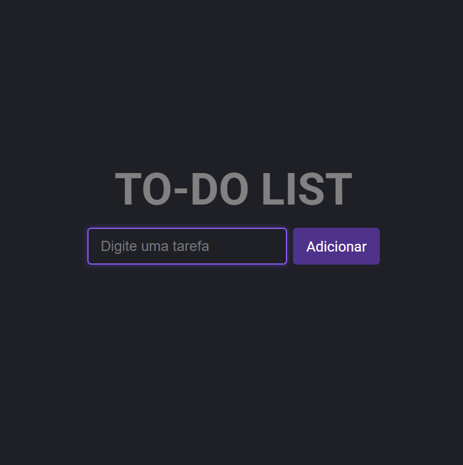

# ToDo-list

# 📝 To-do List

Um projeto simples e moderno de lista de tarefas desenvolvido com **HTML, CSS e JavaScript**, com foco em praticar **manipulação do DOM**, **lógica de programação** e **design responsivo**.

## 🎯 Funcionalidades

- Adicionar tarefas
- Editar tarefas
- Remover tarefas
- Layout escuro com tons de roxo (modo dark moderno)
- Responsivo e com feedback visual (hover, focus)

## 📸 Preview

 

## 💻 Tecnologias usadas

- HTML5
- CSS3 (com variáveis)
- JavaScript puro (Vanilla JS)

## 🚀 Como executar

1. Clone o repositório:
```bash
git clone https://github.com/joaovitorgoncalvessantos1/ToDo-list.git


